 

Player Manager and Game Manager Application

Java V

Table of contents
-----------------

1. [Overview](#overview)
   - [Purpose of the Application](#purpose-of-the-application)
   - [Key Features](#key-features)
2. [Design Choices](#design-choices)
   - [Why Spring Boot and MySQL](#why-spring-boot-and-mysql)
   - [RESTful API Benefits](#restful-api-benefits)
   - [Testing with JUnit and Mockito](#testing-with-junit-and-mockito)
3. [Technical Details](#technical-details)
   - [Technologies Used](#technologies-used)
   - [Architecture](#architecture)
   - [Key Components](#key-components)
4. [Installation Guide](#installation-guide)
   - [Pre-Requisites](#pre-requisites)
   - [Setup Steps](#setup-steps)
5. [Usage Guide](#usage-guide)
   - [Player Management](#player-management)
   - [Manage Friendships](#manage-friendships)
   - [Game Management](#game-management)
   - [Participation Management](#participation-management)
6. [Testing Guide](#testing-guide)
   - [Run All Tests](#run-all-tests)
   - [Mocked Tests](#mocked-tests)

  

Overview:
---------

### 1. [Purpose of the application](#purpose-of-the-application) :

The Player Manager and Game Manager application is a robust solution for managing players, games, and their participation. It is built with Spring Boot for backend logic and MySQL for database persistence. The project includes REST APIs to handle player management, friendships, games, and participation records.

### 2. [Key Features](#key-features):

You can find every feature that I have implemented below:

- Player registration, profile updates, and level management.

-  Friendship creation and retrieval.

-  Game management, including creating, updating, and deleting games.

-  Participation tracking for games.

-  **RESTful API** architecture for ease of integration.

Design Choices:
---------------
### 1. [Why Spring Boot and MySQL](#why-spring-boot-and-mysql):

-  **Spring Boot**: Offers rapid development with built-in configurations, dependency injection, and seamless REST API support.

-  **MySQL**: Reliable and robust for structured data with excellent performance for relational queries.

### 2. [RESTful API Benefits](#restful-api-benefits) :

-  Standardized communication format.

-  Easy integration with frontend and third-party applications.

-  Scalable and maintainable architecture.

### 3. [Testing with JUnit and Mockito](#testing-with-junit-and-mockito) :

-  Unit tests ensure code reliability.

-  Mockito simplifies mocking dependencies to isolate test scenarios.

Technical Details:
------------------

### 1. [Technologies Used](#technologies-used)

This is the technologies that I have used during my project:

-  Backend Framework: Java Spring Boot

-  Database: MySQL

-  Build Tool: Maven

-  Testing: JUnit and Mockito

-  API Framework: REST

-  Others: Lombok, Spring Data JPA

### 2. [Architecture](#architecture)

The application is designed using a **layered architecture**, with a clear separation of concerns. The layers are :

1.  **Controller Layer** :

* Handles HTTP requests and generates HTTP responses.
* Maps REST API endpoints to specific service methods.
* Acts as the entry point for client interactions.
* Example : PlayerController, GameController, ParticipationController.

3.  **Service Layer** :

* Contains the application's **business logic**.
* Ensures validations and coordinates between the controller, repository, and external systems.
* Example : PlayerService, GameService, ParticipationService.

5.  **Repository Layer (DAO)** :

* Directly interacts with the database.
* Uses **Spring Data JPA** to manage data persistence and CRUD operations.
* Example: IGameDAO, IParticipationDAO. GameDAO, ParticipationDAO

7.  **Entity Layer** :

* Represents the **database tables** as Java objects.
* Annotated with JPA annotations like @Entity, @Table, @Column, etc.
* Example : Player, Game, Participation.

9.  **DTO Layer (Data Transfer Objects)**:

* Used to transfer data between layers without exposing the actual entity structure.
* Ensures a clear boundary between API consumers and internal models.
* Example: CreateGameDTO, GetGameDTO, UpdateGameDTO, CreateParticipationDTO.

11. **External API Layer** :

* Facilitates communication with external systems via �**WebClient�**.
* Example: Validating player existence or updating player statistics.

### 3. [Key Components](#key-components)

#### � [Entities](#entities)

You can find the different entities beside:

1.  **Player**: Stores information about players.
2.  **Game** : Represents game details.
3.  **Friend** : Manages player friendships.

4. **Participation**: Tracks player participation in games

#### � [Database Schema](#database-schema)

There is all the table of mySQL Database:

1. Player: id, username, email, level, total_points

2. Friend: id, player\_id, friend\_id

3. Game: id, date, game\_type, max\_score, host_id

4. Participation: id, game\_id, player\_id, score, win

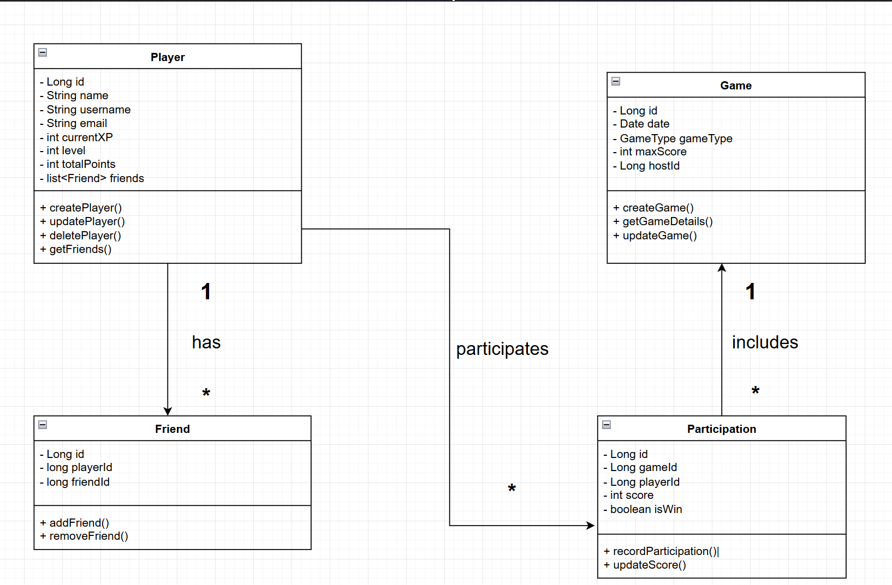

#### � [REST API Endpoints](#rest-api-endpoints)

* **Player Management**

* POST /players: Create a new player.
* GET /players/{id}: Retrieve a player's details.
* PUT /players/{id}: Update a player's profile.
* POST /players/{id}/update-stats: update player statistics
* DELETE /players/{id}: Delete a player.

* **Friend Management**

* POST /players/{id}/friends: Add a friend.
* GET /players/{id}/friends: Get all friends of a player.
* DELETE /players/{id}/friends: Remove a friend.

* **Game Management**

* POST /games: Create a game.
* GET /games/{id}: Retrieve a game's details.
* PUT /games/{id}: Update a game.
* DELETE /games/{id}: Delete a game.

* **Participation Management**

* POST /games/{gameId}/participations : Register a participation.
* GET /games/{gameId}/participations/{id} : Retrieve participation details.

Installation Guide:
-------------------

### 1. [Pre-Requisites](#pre-requisites) :

� Java 21 installed.

� MySQL database installed and running.

� Maven installed.

### 2. [Setup Steps](#setup-steps) :

Clone the Repository from **GitHub** :

This project consists of **two modules**: Player Manager and Game Manager. Each module resides in its respective folder and has its own dependencies and configurations. To set up both modules, follow these steps

**Open your terminal and execute the following commands below:**

1. **git clone**  [https://github.com/pamenoda/Player-Manager-and-Game-Manager.git](https://github.com/pamenoda/Player-Manager-and-Game-Manager.git)

**_2._** **_cd Player-Manager-and-Game-Manager_**

After that **you must set up the application. Properties** file of each module with similar options:

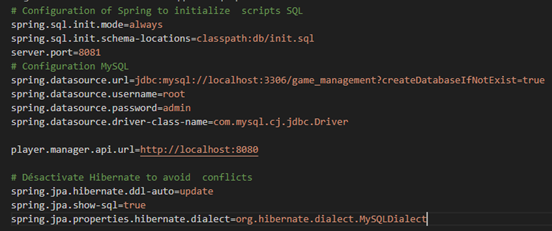

**You have the username and password to change and the url if different**

**This is the �application properties� of game-manager, is also required to change the �application.Properties� of player-manager: username, password, url of database!**

Now you can try to run both applications like this:

**�**Open one terminal for Player Manager and start it:

**1.** **cd Player-Manager-and-Game-Manager/player-manager**

**2.** **mvn spring-boot:run**

Open another terminal for Game Manager and start it:

**1.** **cd Player-Manager-and-Game-Manager/game-manager**

**2.** **mvn spring-boot:run**

if you have failed to run both applications:

_1._ _check the Pre-requisites._

Usage Guide:
------------

use a tools like �PostMan� for test request!

### 1. [Player Management](#player-management) :

#### � [Create a Player](#create-a-player) :

This is a request Post where we have created a player with a body as response:

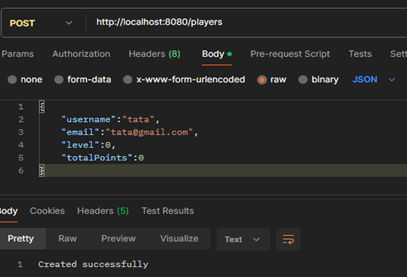

#### � [Retrieve a Player](#retrieve-a-player) :

Here we don�t need body only we have put the id of the player in the path directly:

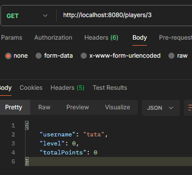

#### � [Update Player Stats](#update-player-stats) :

�There, we have inserted the score to add in the body of the request Post:

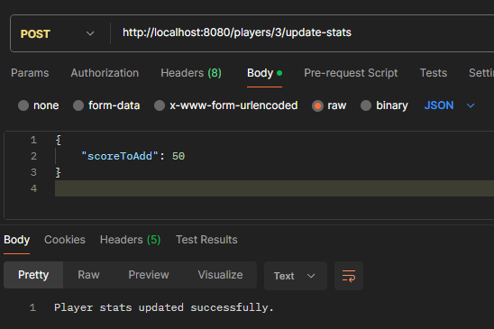

### 2. [Manage Friendships](#manage-friendships) :

#### � Add friend:

Post request with a body of the id of player and the id of friend:

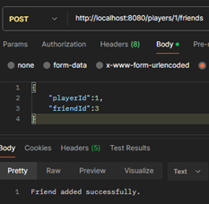

#### � Remove friend:

We have removed the friend with the id 4 from the list of friends of the player with id 1:

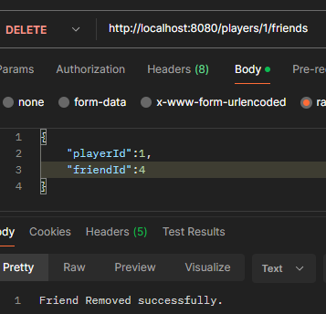

#### � Get friends:

Get request without body to fetch the list of friends with username, level, total Points:

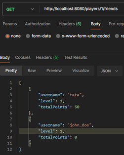

### 3. [Game Management](#game-management) :

#### � [Create a Game](#create-a-game):

We can create a game with a Postman request like this:

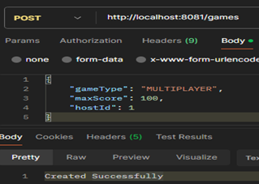

**Expected Constraints:**

* **gameType** should be a valid enum value (SINGLE_PLAYER, MULTIPLAYER, TOURNAMENT).
* **maxScore** must be a positive integer.
* **hostId** must reference an existing player in the Player database.

#### � Get a game:

To get a game, we have only to put the id on the url like this without body:

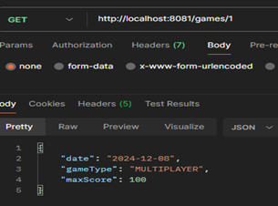

**It sends us all information�s about the game�**

#### � Delete a game:

This is the request for delete game same url but just change the type of request instead of getting we have deleting:

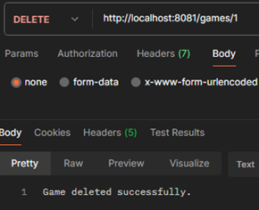

### 4. [Participation Management](#participation-management)

#### � [Register Participation](#register-participation) :

This is the request to register a participant to the game with the id in the url of the request:

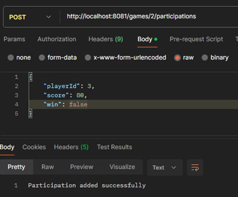

**Expected Constraints:**

* **Player Id** must reference an existing player in the Player database.

#### � [Retrieve Participation](#retrieve-participation) :

You add the participation id to retrieve the information about the participation of a player and his score:

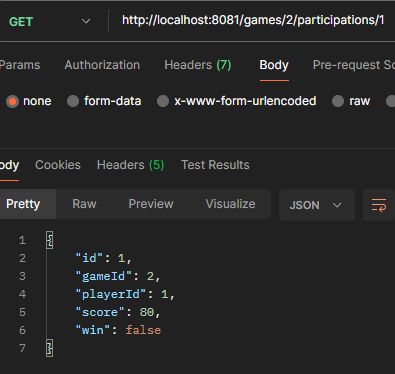

Testing Guide:
--------------

### 1. [Run All Tests](#run-all-tests) :

To execute all tests, we must open two terminals for each app

And type this command:

**Mvn test**

### 2. [Mocked Tests](#mocked-tests) :

Mocked tests are a testing technique used in unit testing to isolate the code being tested from external dependencies, such as databases or external APIs. By using a library like **Mockito**, you can create mock objects that simulate the behavior of real dependencies. This ensures the unit test focuses only on the logic of the class or method being tested without worrying about the actual implementation of the external systems.

Example:

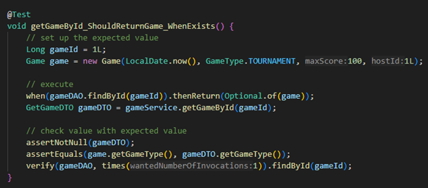

**Purpose**: The method name describes what is being tested: that the getGameById method should successfully return a game when it exists in the database.

**Test Steps**

**Step 1: Set Up the Expected Value**

* The test sets up a mock gameId (e.g., 1L) and a mock Game entity with known attributes (e.g., date, game type, max score, host ID).
* This mock game represents what the database would return if queried with the given gameId.

**Step 2: Mock Behavior of gameDAO**

* The when(gameDAO.findById(gameId)).thenReturn(Optional.of(game)) line mocks the behavior of the gameDAO repository.
* It ensures that whenever the findById method is called with the given gameId, it returns the mock game wrapped in an Optional.
* This eliminates the need for actual database interactions.

**Step 3: Execute the Method**

* The gameService.getGameById(gameId) call invokes the service method being tested.
* The method retrieves a GetGameDTO object, which should be a transformed version of the mock Game entity.

**Step 4: Validate the Result**

* **assertNotNull(gameDTO)**: Checks that the service returns a non-null object.
* **assertEquals(game.getGameType(), gameDTO.getGameType())**: Verifies that the game type in the returned DTO matches the game type of the mock entity.
* These assertions confirm that the service logic correctly retrieves and converts the data.

**Step 5 : Verify Mock Interactions**

* **verify (gameDAO, times (1)). findById(gameId)**: Ensures that the findById method in the gameDAO repository was called exactly once.
* This step validates that the service interacts with the repository as expected.

This is an example of one of the various tests implemented for the application.

Conclusion:
-----------

Through this project, I had the opportunity to design and develop a comprehensive player and game management system using modern **Java** technologies like **Spring Boot, JPA, and Mockito** for testing. By implementing features such as player management, game creation, and participation tracking, I deepened my understanding of **RESTful API design**, layered architecture, and database integration.

The challenges faced during the development process, such as implementing validations, managing external API dependencies, and ensuring test coverage with mocks, were instrumental in sharpening my problem-solving skills. I also gained practical experience in debugging, configuring **MySQL databases**, and managing a Spring-based application.

This report serves as a comprehensive guide to understanding the project's architecture, setup process, and usage. It provides a detailed breakdown of each module and its functionality, along with explanations of critical design choices and testing strategies. The structured approach ensures that the application is not only functional but also maintainable and scalable for future enhancements.

I am confident that this project showcases my ability to develop reliable software solutions while adhering to best practices. It has been a valuable learning experience, and I look forward to applying these skills to future projects.
